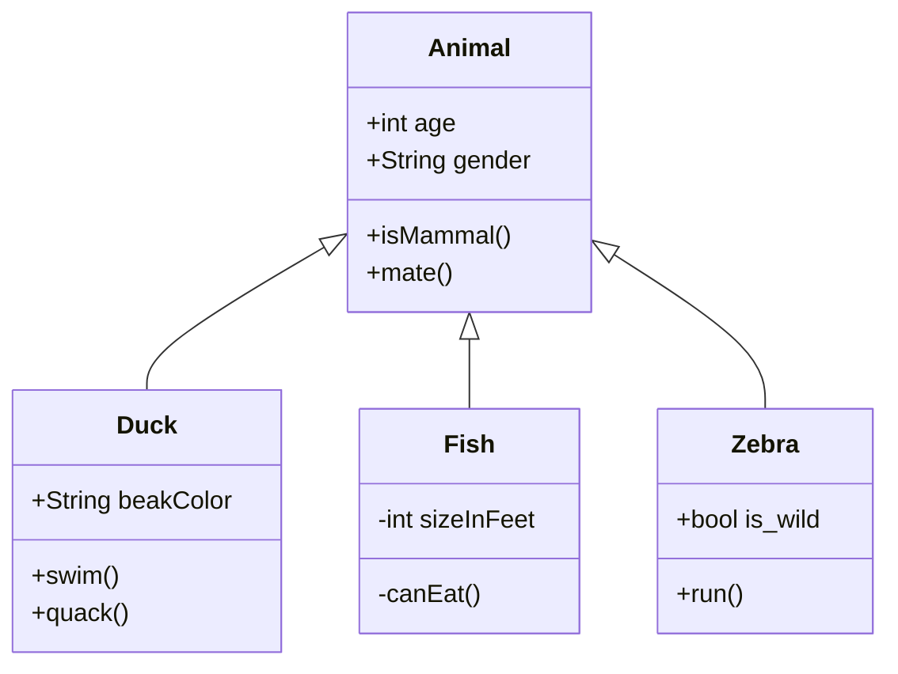
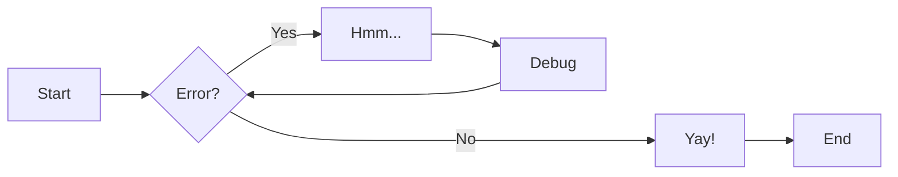
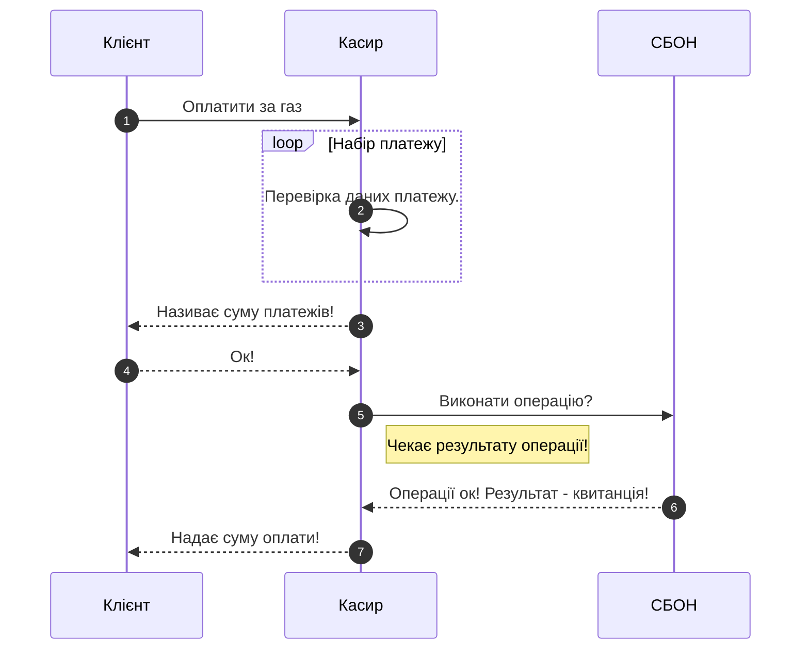
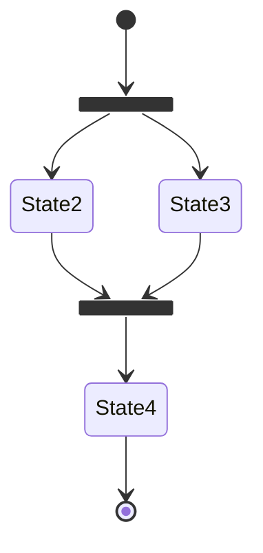
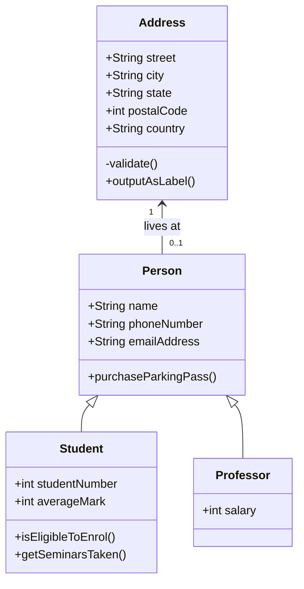
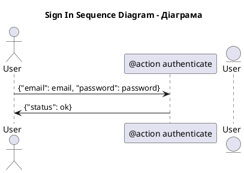
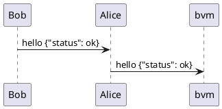

# Приклади 
<!-- # Examples -->
<!--  -->

## Приклади використання ***MARKDOWN***

В цьому документів  буде описана вся документація по СБОН+,

будуть присутні такі розділи:

* Загальний опис системи. 
* Архітектура СБОН
* Опис бази даних 
* Помилки системи

_Приклад_ **речення**.

### Перехід на іншу сторінку

__[GoToNewPage]__ – Choose out of the 60+ supported languages or add a new one

[GoToNewPage]: VS_code.md

### Grid

<div class="grid cards" markdown>

- :fontawesome-solid-earth-americas: __[Language]__ – Choose out of the 60+ supported languages or add a new one
- :material-page-layout-sidebar-left: __[Navigation]__ – Create a clear, concise, and comprehensive navigation structure
- :material-page-layout-header: __[Header]__ – Customize the behavior of the header, add an announcement bar
- :material-page-layout-footer: __[Footer]__ – Add links to your social media profiles or websites in the footer
- :material-tab-search: __[Search]__ – Set up and configure search, running entirely in the user's browser
- :material-tag-plus-outline: __[Tags]__ – Categorize your pages with tags and group related pages

</div>


***Схема***

> _Приклад цитати:_ Dorothy followed her through many of the beautiful rooms in her castle. 

### Картинки
---
 
 <br>
---


*Загальна Схема СБОН*


<!-- важливо вказувати такий шлях для картинок в HTML-->

 
<figure>
    
    <figcaption> Загальна Схема СБОН.</figcaption>
</figure>

### Відео

[](https://www.youtube.com/watch?v=zCZB__ZK4Xs)

[](https://www.youtube.com/watch?v=zCZB__ZK4Xs)


### Посилання

Перейти на іншу сторінку [Page Description](<../About Sbon/index.md>).

Markdown
```
: Інструмент перетворення тексту в HTML
```
Філософія Markdown
: Мова `Markdown` покликана бути такою ж простою для читання та простотою для написання, наскільки це можливо

StackEdit
: Редактор `Markdown` в браузері

### HTML в markdocs

#### Гарячі клавіші

<kbd>Ctrl</kbd>+<kbd>C</kbd>

<kbd>Ctrl</kbd>+<kbd>V</kbd>

<a href="https://google.com.ua" target="_blank" title="Google">Google</a>

#### YouTube відео 

<div class="responsive-video"><iframe width="560" height="315" src="https://www.youtube.com/embed/wgbV6DLVezo" frameborder="0" allow="accelerometer; autoplay; encrypted-media; gyroscope; picture-in-picture" allowfullscreen></iframe></div>

#### Локальне відео 

<div class="responsive-video"><iframe src="remark/assets/control_presentation.mp4" width="560" height="315" autoplay=false></iframe></div>


### Списки

1. Перший
   * підперший
2. Другий
   
* Перший
* Другий

1. First item
2. Second item
3. Third item
    * Indented item
    * Indented item
4. Fourth item

***

### Вказівники [www.beskyd.com](https://www.beskyd.com)

Наш сайт *[www.beskyd.com](https://www.beskyd.com)*

Так вказано email: <bvm@beskyd.com>

[hobbit-hole][11]

Ту є вказівник на компанію [Бескид Ком][2]

[11]: https://en.wikipedia.org/wiki/Hobbit#Lifestyle "Hobbit lifestyles"
[2]: https://beskyd.com/ 'Це адреса сайту Бескид Ком'

***

### Ідентифікатори заголовків
<!-- посилання тільки англійськми буквами  -->
[Грід](#grid)

> :warning: **Warning:** Do not push the big red button.
> :memo: **Note:** Sunrises are beautiful.
> :bulb: **Tip:** Remember to appreciate the little things in life.

Авторське право (&copy;) —&copy;


| Syntax      | Description |
| ----------- | ----------- |
| Header      | Title |
| Paragraph   | First paragraph. <br><br> Second paragraph. |
| Заголовок   | Опис |
| Картинка   |  |
| List        | Here's a list! <ul><li>Item one.</li><li>Item two.</li></ul> |

### Вирівнювання в таблиці

| Syntax      | Description | Test Text     |
| :---        |    :----:   |          ---: |
| Header      | Title       | Here's this   |
| Paragraph   | Text        | And more      |

### таблиці

| Method      | Description                          |
| ----------- | ------------------------------------ |
| `GET`       | :material-check:     Fetch resource  |
| `PUT`       | :material-check-all: Update resource |
| `DELETE`    | :material-close:     Delete resource |


| Method      | Description                          |
| :----------:| :-----------------------------------:|
| `GET`       | :material-check:     Fetch resource  |
| `PUT`       | :material-check-all: Update resource |
| `DELETE`    | :material-close:     Delete resource |

### Іконки 
:smile:
:fontawesome-brands-youtube:{ .youtube }

### Блоки, підсвічування синтаксу

```json linenums="1"
{
  "firstName": "John",
  "lastName": "Smith",
  "age": 25
}
```
### Приклад SQL
```sql
/* приклад SQL*/
select * from operjrnl order by numoper;
go
```

### Приклад XML

```xml
<?xml version="1.0" encoding="UTF-8"?>
<note>
  <to>Tove</to>
  <from>Jani</from>
  <heading>Нагадування</heading>
  <body>Не забудь мене в ці вихідні!</body>
</note>
```

### Приклад для PYTHON

```python title="Приклад програми PYTHON"
# Import necessary libraries
import dash
from dash import html
from dash import dcc
from dash.dependencies import Input, Output
import flask
import json
# Create a Dash web application
app = dash.Dash(__name__)

# Create a Flask server for the REST API
server = app.server
```

### Приклад на JAVA

```java title="Приклад програми JAVA"
public class Example {
    public static void main(String[] args) {
        System.out.println("Hello, World!");
    }
}


```java
public static void main(String[] args) {
    Scanner scanner = new Scanner(System.in);

    System.out.print("Сколько процентов заряда батареи осталось на вашем смартфоне?");
    int a = scanner.nextInt();

    if (a < 10) {
        System.out.println("Осталось менее 10 процентов, подключите ваш смартфон к зарядному устройству");
    } else {
        System.out.println("Заряда вашей батареи достаточно для того, чтобы прочитать статью на Javarush");
    }
}
```

### Вкладки

=== "C"

    ``` c
    #include <stdio.h>

    int main(void) {
      printf("Hello world!\n");
      return 0;
    }
    ```

=== "C++"

    ``` c++
    #include <iostream>

    int main(void) {
      std::cout << "Hello world!" << std::endl;
      return 0;
    }
    ```
### Вкладки вмісту
=== "Unordered list"

    * Sed sagittis eleifend rutrum
    * Donec vitae suscipit est
    * Nulla tempor lobortis orci


=== "Ordered list"

    1. Sed sagittis eleifend rutrum
    2. Donec vitae suscipit est
    3. Nulla tempor lobortis orci

### Вкладки вмісту в попередженні

!!! example

    === "Unordered List"

        ``` markdown
        * Sed sagittis eleifend rutrum
        * Donec vitae suscipit est
        * Nulla tempor lobortis orci
        ```

    === "Ordered List"

        ``` markdown
        1. Sed sagittis eleifend rutrum
        2. Donec vitae suscipit est
        3. Nulla tempor lobortis orci
        ```

### Закреслення


~~The world is flat.~~ We now know that the world is round.

### Списки завдань 

* [x] Write the press release
* [ ] Update the website
* [ ] Contact the media


I need to highlight these ==very important words==.

### Виноска

Це текст з виноскою.[^1]

Ще один рядок тексту.[^2]


[^1]: Це відноситься до виноски 1.

[^2]: А це до виноски 2.

Some of these words <ins>will be underlined</ins>.

### Центр

<center>This text is centered.</center>

### Відступ

&nbsp;&nbsp;&nbsp;&nbsp;&nbsp;This is the first sentence of my indented paragraph.

### Примітка 

!!! question "Примітка"

    Lorem ipsum dolor sit amet, consectetur adipiscing elit. Nulla et euismod
    nulla. Curabitur feugiat, tortor non consequat finibus, justo purus auctor
    massa, nec semper lorem quam in massa.

???+ note "Примітка"

    Lorem ipsum dolor sit amet, consectetur adipiscing elit. Nulla et euismod
    nulla. **Curabitur** feugiat, tortor non consequat finibus, justo purus auctor
    massa, nec semper lorem quam in massa

### Текст з анотаціями

Lorem ipsum dolor sit amet, (1) consectetur adipiscing elit.
{ .annotate }

1. :man_raising_hand: Це анотація ! Може містити код `code`, __форматований текст__, картинки, ... ... загалом усе, що можна записати в Markdown.


### Колір тексту

<font color="red">This text is red!</font>
<p style="color:blue">Make this text blue.</p>

### Коментар 

Here's a paragraph that will be visible.


And here's another paragraph that's visible.

### Flowchar Diagram 


## [Діаграми](https://squidfunk.github.io/mkdocs-material/reference/diagrams/)

```flow
st=>start: Login
op=>operation: Login operation
cond=>condition: Successful Yes or No?
e=>end: To admin

st->op->cond
cond(yes)->e
cond(no)->op
```


### діаграми класів 



### Використання блок-схем


### Діаграма послідовності



### Діаграма стану



### Діаграма класів



### Sequence Diagram  
<!-- plantuml-markdown -->






### Форматування

Text can be {--deleted--} and replacement text {++added++}. This can also be
combined into {~~one~>a single~~} operation. {==Highlighting==} is also
possible {>>and comments can be added inline<<}.

{==

Formatting can also be applied to blocks by putting the opening and closing
tags on separate lines and adding new lines between the tags and the content.

==}

- ==This was marked==
- ^^This was inserted^^
- ~~This was deleted~~


### Commands - приклад

* `mkdocs new [dir-name]` - Create a new project.
* `mkdocs serve` - Start the live-reloading docs server.
* `mkdocs build` - Build the documentation site.
* `mkdocs -h` - Print help message and exit.

***

## Коротка інструкція  для редагування

For full documentation visit [mkdocs.org](https://www.mkdocs.org).

## Commands

* `mkdocs new [dir-name]` - Create a new project.
* `mkdocs serve` - Start the live-reloading docs server.
* `mkdocs build` - Build the documentation site.
* `mkdocs -h` - Print help message and exit.

## Project layout

    mkdocs.yml    # The configuration file.    
    docs/
    index.md  # The documentation homepage.
        ...       # Other markdown pages, images and other files.
