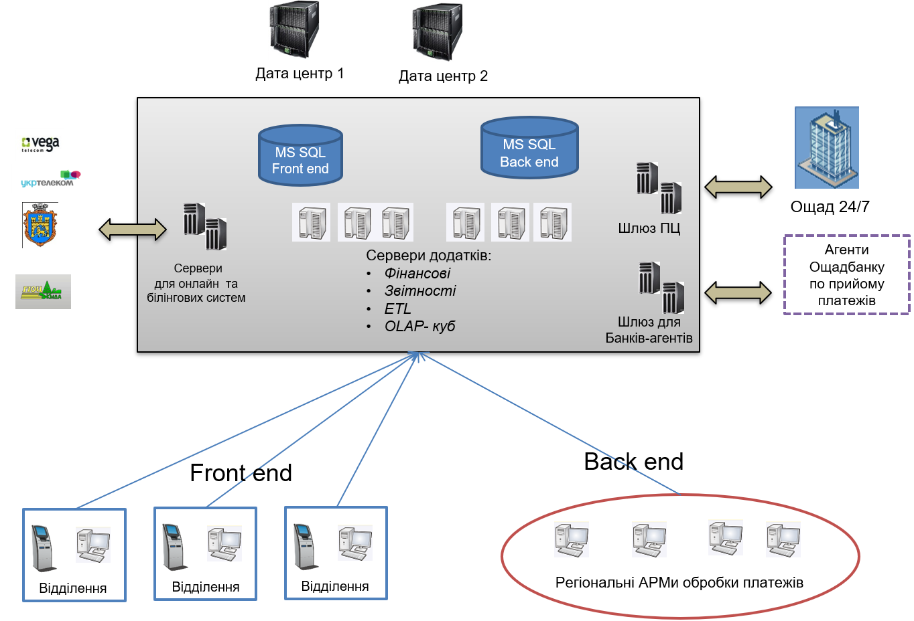

# Архітектура СБОН+
## Загальна схема

В СБОН включає наступні компоненти:

- **Back-end**
     - Фінансовий сервер;
     - Сервер звітності
     - Куб даних 
     - Сервер ETL експортно-імпортних операцій.
     - Сервер інтеграції з Ощад 24/7 
     - Сервер інтеграції з білінговими системами постачальників послуг
     - Шлюз для агентів прийому платежів (банків і організацій)
- **Front-end** 
     - АРМ касира - приймання платежів.
     - АРМ бек-офису, обробки платежів.
     - ІПТ (кіоски) - терміна приймання  платежів.
     - ПТТЕ - платіжні термінали касового обслуговування.
     - АРМ адмістрування
   

