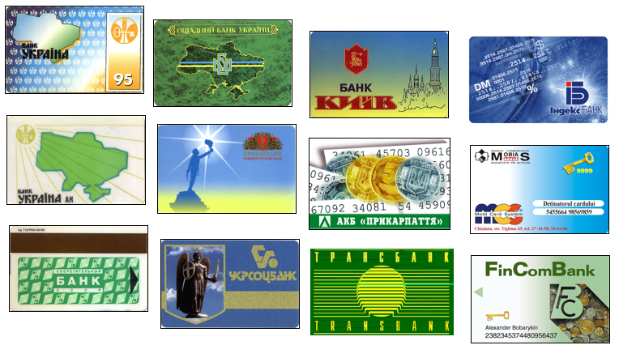
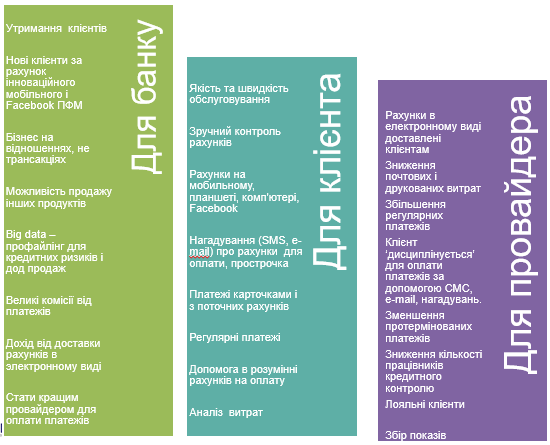

#  Про СБОН+

## Загальний опис СБОН+

### Коротка історична довідка

**СБОН** - Система Банківського Обслуговування Населення

Перший прототип системи був створений в 1991 році під назвою АСБОН(*автоматизована СБОН*) і впроваджений в АТ "Ощадбанк" м. Калуш Івано-Франківської області.
Подальший розвиток системи був дозволив впровадити її в інших банках України і Молдови.

В 1994 р. СБОН була впровадження в НБУ, як перший в Україні зарплатний проект для працівників Національного банку з використанням ідентифікаційних карток. Картка використовувалася для отримання готівки, безготівкового розраху в ідальнях і магазинах НБУ

В 2003 році була створена компанія ТОВ НВП "Бескид Ком", яка розвинула ПЗ СБОН і вийшла оновлення версія системи СБОН+.
В даний час СБОН+ версії 4.0 впроваджена в АТ "Ощадбанк", як єдина ценралізована система приймання платежів населення.

### СБОН+ (NicePay)

**СБОН+** - це інтегрована B2C (Business-To-Consumer)платформа, яка доставляє комунальні рахунки на пристрої, яким надає перевагу користувач (смартфон, планшет, комп’ютер), чи місця, які він відвідує (Facebook, відділення банку, кіоск (ЦСО), банкомат), що надає нагадування і аналітику

### Система дозволяє банкам

- Стати одним з лідерів на ринку прийому платежів.
- Забезпечити прийом платежів на робочих місцях операціоністів, ІПТ(кіоски), через інтернет, мобільні пристрої. 
- Замінити неконкурентні продукти на передові технології.
- Запропонувати клієнтам нові конкурентні послуги.
- Диференціювати від традиційних методів прийому платежів.
- Інтегруватися з існуючими програмними продуктами компанії та іншими сторонніми системами.
- Збільшити кількість прийнятих платежів, покращити якість обслуговування.
- Залучити нових клієнтів, особливо серед молодого покоління.
- Забезпечити переведення транзакційного бізнесу на мало затратні он-лайн канали.
- Покращити  динаміку росту прибутковості даного бізнесу.
  

### Значимість пропозиції

