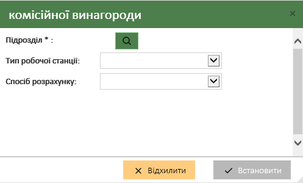
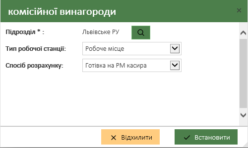
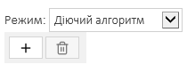


<!--  -->

<!--  -->
# Інструкція налаштування договорів

*(Редакція 1.3)*

## Історія змін

|Версія|Дата|Автор змін|Опис змін|
| :- | :- | :- | :- |
|1.2|11.06.2019|Богдан Ірза|Виправлено опис створення договорів. Виправлено скріншоти.|
|1.3|12.06.2019|Богдан Ірза|Добавлено опис поля **Статус** і **Режим**.|

## **Зміст**

[Термін та скорочення](#_toc12511173)

[Загальна інформація](#_toc12511174)

[Інструкція користувача](#_toc12511175)

[Порядок заведення договорів](#_toc12511176)

[Вхід в підсистему адміністрування](#_toc12511177)

[Основна форма вводу даних](#_toc12511178)

## **Термін та скорочення**

|**Банк** |- АТ «Ощадбанк»|
| - | - |
|**СБОН**|- Система банківського обслуговування населення|
|**ПТКС**|- Програмно-технічний комплекс самообслуговування|
|**Підсистема**|- Підсистема адміністрування  довідкової бази і налаштування операцій СБОН|
|**Платник**|- Особа, що здійснює платіж в касі банку та через ПТКС|
|**Отримувач**|- Організація, яка надає послуги, і якій анк перераховує платежі, прийняті від Платника.|
|**ЄРЦ**|- Централізована база даних платників, рахунків за комунальні послуги, (наприклад ЕРЦ – м. Донецьк)|
|**ІЦП**|- Зовнішні Інформаційні центри з базами платників, які підтримуються організаціями – отримувачами платежів. Організації надають Банку on-line доступ|
|**РУ**|- Регіональне управління Банку|
|**ПЗ**|- Програмне забезпечення підсистеми адміністрування довідників|
|**АРМ** |- Автоматизоване робоче місце|

## **Загальна інформація**

В документі  описано інструкцію з введення договорів у систему прийому платежів населення СБОН.

Редагування і налаштування договорів виділена в окремий розділ документа і складається з двох етапів:

- Ведення договорів на рівні користувача системи.
- Ведення договорів на рівні адміністратора системи.

Працівник, відповідальний за введення параметрів договору,  на першому етапі, а саме, введення даних отримувача, даних платежу, параметрів комісійного збору і налаштування аналітичного обліку.

Адміністратор системи проводить додаткове налаштування договору – налаштування параметрів запитів інформації про платника, форм вводу реквізитів платежу та шаблони квитанцій.

Адміністратор системи має можливість і може вносити зміни в існуючі та додавати нові договори в систему.

## **Інструкція користувача** 
### **Порядок заведення договорів**

При заведенні договорів необхідно дотримуватися наступного порядку:

1. Проаналізувати, чи даний договір є новим для системи, чи до існуючого договору потрібно додати нові параметри платежу. Для цього потрібно виконати пошук і перевірити, чи є такий договір  в системі.
1. Якщо договір існує, потрібно вибрати режим «**Редагувати договір**».
1. Якщо договір відсутній, потрібно «**Додати новий договір**». При цьому заповнюються основні реквізити договору: **Номер договору, дати початку і закінчення дії договору, статус, та встановити групу приналежності.**
1. Наступним кроком необхідно додати отримувача платежу і заповнити параметри: **Назва організації, ЄДРПОУ, Контактна особа, Телефон, Адреса.**
1. Далі додаються  параметри платежу: **МФО банку, Рахунок отримувача, Ознака групування платежів, Транзитний рахунок, Статус платежу**.  Якщо в системі відсутній транзитний рахунок, необхідно звернутися до адміністратора системи  для добавлення такого рахунку в систему.
1.Також потрібно ввести додаткові параметри: **Назва платежу, Кас. Символ, Код класифікації(група).**
1. Наступним кроком потрібно, згідно умов договору, додати  налаштування комісійного збору з платника, чи комісійного збору з отримувача платежу. Параметри вибираються з довідника комісійних зборів. Якщо немає необхідних даних в довіднику, необхідно звернутися до адміністратора системи для додавання необхідного виду комісії в систему.
1. Додаткове налаштування договору повинен виконувати адміністратор системи.

### **Вхід в підсистему адміністрування**

Для входу і реєстрації в Підсистемі необхідно зайти на визначену сторінку з використанням  InternetExplorer версії 10.0 і вище. Головна форма входу виглядає наступним чином:

Необхідно ввести логін, пароль користувача та номер робочої станції. По замовчуванню номер робочої станції зберігається в локальному сховищі InternetExplorer, тому після наступного входу він зберігається. Після позитивної авторизації відкривається основна форма редагування системи. В лівому меню можна вибр[](img/Asposeати доступний довідник для редагування даних.

### **Основна форма вводу даних**
Головна форма редагування договорів відображає список всіх договорів. Користувач може додати новий договір, редагувати існуючий та встановити область дії пункту договору.

`	`Для пошуку договорів використовується панель фільтрування, де вказується за якими критеріями буде виконуватись пошук. Наприклад, для пошуку по номеру договору потрібно задати фільтр зображений на рис. нижче та натиснути кнопку .  Для очищення фільтрів використовується кнопка .  Для добавлення - . Кнопка  використовується для розгортання списку накладених фільтрів.

Для створення нового договору потрібно натиснути кнопку меню “Додати новий договір”, після чого відкриється форма створення нового договору.

`	`На вкладці “ЮРИДИЧНИЙ ДОГОВІР” заповнюємо необхідну інформацію (поля відмічені \* - обов’язкові для заповнення) та вибираємо групу приналежності договору (місцевий, регіональний, загальний), після чого тиснемо кнопку “Далі” та переходимо на вкладку “ОТРИМУВАЧІ” .

`	`На даній вкладці є можливість додати нового отримувача або вибрати існуючого. При помилковому добавленні отримувача або при потребі видалити отримувача із даного договору – потрібно відмітити необхідного отримувача, після чого стає активна кнопка «Вилучити з договору»,  при натисканні якої вибраний отримувач видаляється.  При виборі пункту “Додати нового отримувача” – відкриється вкладка “ДАНІ ОТРИМУВАЧА” де заповнюємо інформацію про отримувача (поля відмічені \* - обов’язкові для заповнення) та натиснути кнопку “Далі”. Кнопка  на вкладці “ДАНІ ОТРИМУВАЧА” використовується для пошуку та встановлення даних існуючого отримувача.

У випадку, коли по вказаному ЄДРПОУ вже існують договори, система видасть повідомлення, де є можливість встановити знайдену організацію або створити нову.

`	`На вкладці ПЕРЕЛІК ПУНКТІВ ДОГОВОРУ додаємо новий пункт договору. При потребі вилучення пункту з договору можна скористатися кнопкою «Вилучити з договору», для активації якої потрібно виділити необхідний платіж.

`	`Після чого відкриється вкладка “ДАНІ ПУНКТУ ДОГОВОРУ”, де потрібно заповнити, або редагувати реквізити платежу (поля відмічені \* - обов’язкові для заповнення) та на тиснути кнопку “Далі”. В полях «Транзитний рахунок», «Касовий символ», «Класифікатор» - можливий пошук потрібних даних з довідників при введенні декількох символів.

«Cубрахунок» - поле субрахунок заповнюється у випадку необхідності розмежування консолідації різних платежів в межах одного договору (окрема платіжка на кожен вид платежу). 

«Статус пункту договору\*» - дає можливість заблокувати вибраний палтіж у даному договорі.

«Набір тегів платежу» - кнопка “Додати тег” використовується для встановлення додаткових приміток приналежності договору (наприклад: комунальний, бюджетний, страховий…). Параметр не впливає на прийом платежів, тільки зміст інформаційного характеру.

«Додаткові параметри платежу» - кнопка “**Додати додаткові влативості**” встановлює додаткові властивості  договору, такі як можливість при зміні рахунку здійснити перенаправлення коштів з одного рахунку на інший на момент прийому платежу, встановити ознаку комунального платежу.

При зміні існуючого рахунку на новий потрібно активувати вказану вище властивість

`	`Встановлення ознаки комунального платежу: дана ознака призначається для розрахунку комісії в пільговому режимі при оплаті в платіжних терміналах.

`	`Після встановлення ознаки комунального платежу, щоб пільга була діючою для даного платежу, потрібно активувати ознаку.

`	`«Набір тегів операції» - кнопка “Додати тег” добавляє типовий набір об’єктів для операції (форма, тип вибору, квитанція)  

`	`На вкладці “НАЛАШТУВАННЯ КОМІСІЙНОЇ ВИНАГОРОДИ” існує можливість встановити комісійну винагороду з платника та отримувача. 

`	`На початку заведення комісійної винагороди потрібно вказати область використання, система дозволяє використовувати різну комісію в залежності від підрозділу, типу робочої станції та способу розрахунку. Для одного договору і виду комісійного збору існує можливість вказувати декілька областей використання. Тобто комісійна винагорода при необхідності може бути розрахована в окремому ТВБВ, ІПТ чи по банку вцілому за різними тарифами. 

`	`Кнопка “Додати область використання” відкриває вкладку встановлення підрозділу, типу робочої станції та способу розрахунку, 

де за допомогою кнопки   є можливість знайти необхідний підрозділ (доступні фільтри по типу підрозділу та полях),

встановити тип робочої станції та спосіб розрахунку.

Для видалення помилково добавленої області використовується кнопка 

Процедура добавлення критеріїв зв’язків обслуговування аналогічна для комісійних винагород з отримувача та платника.

`	`Параметри(налаштування) вибраної комісії можна переглянути та при необхідності відкорегувати у формі «Налаштування комісійної винагороди». 

`	`Під час  коригування існуючої комісійної винагороди слід пам’ятати, що даний алгоритм розрахунку може використовуватися для інших комісійних винагород, тому перед збереженням відповідних змін система видасть повідомлення, де потрібно обрати, або «Так для всіх», якщо виконані зміни стосуються усіх алгоритмів, або «Ні, створити нову комісію на основі існуючої», якщо дані зміни не стосуються існуючих. 

`	`Після цього система перевірить чи даний комісійний збір використувується в наборах об’єктів (це може бути платіж в меню, або договір), якщо комісія вже використовується, буде видано повідомлення, де потрібно вибрати «Так», якщо виконані зміни належать до цих наборів об’єктів, або «Ні, створити нову на основі існуючої», якщо зміни не стосуються існуючих наборів об’єктів.

Якщо в системі відсутній комісійний збір на закладці налаштування комісійної винагороди, потрібно натиснути кнопку 

В межах однієї області дії можливо застосовувати тільки одну комісійну винагороду. Якщо комісійна винагорода для області дії вже встановлена, то система про це повідомить. 

Для нової комісійної винагороди потрібно вказати «Назву» та «Режим» зняття комісійної винагороди.

Після заповнення даних полів в редакторі будуть доступні додаткові поля для налаштування, де потрібно вибрати «класифікатор» комісійного збору, при потребі вказати рахунок Дебет , обов’язково вказати  «Кредит», у полі «Статус» обрати необхідний статус, далі потрібно вибрати «Додаткові параметри комісії»,

Для розрахунку комісійного збору потрібно налаштувати алгоритм розрахунку.

У полі «Алгоритм розрахунку» існує можливість вибору алгоритму з довідника , а при потребі добавити новий .

При створенні нового алгоритму потрібно вказати його назву  (стає доступним після натискання кнопки «+»), а також налаштувати шкалу алгоритму.

Для початку потрібно вибрати «Режим». Щоб алгоритм став робочим потрібно вибрати «Діючий алгоритм»,  далі необхідно натиснути кнопку «+», після чого у списку буде створено новий запис з початковими значеннями.

Після цього потрібно новий запис відмітити, щоб була доступна форма введення даних.

У формі внести необхідні параметри: початкову суму дії алгоритму, кінцеву суму, відсоток, фіксовану суму при необхідності (фіксована сума буде додана до відсотку для даного діапазону), мінімальна сума при необхідності (мінімальна сума буде застосовуватися, якщо розмір комісії менший за мінімальну суму для даного діапазону), початкову дату та кінцеву дату дії діапазону.

Для видалення шкали необхідно натиснути кнопку . 

Для видалення комісії необхідно натиснути хрестик навпроти непотрібної комісії. 

По замовчуванню комісійні винагороди встановлюються на підрозділ система, що вказує дію комісійної винагороди на всю систему Банку для даного платежу згідно договору. 

`	`Після заповнення всіх необхідних даних потрібно натиснути кнопку  - відкриється повідомлення про успішне збереження договору

та кнопку  для закриття форми створення нового договору.

Кнопка «Область дії пункту договору» на вкладці редагування договорів відкриває форму встановлення правила доступу, де потрібно створити нове правило доступу або встановити існуюче. По замовчуванню доступ встановлюється на «Систему», тобто на всі підрозділи. 

Для створення нового правила доступу необхідно натиснути кнопку «Нове правило доступу», вказати назву правила та вибрати область дії.

Наприклад, для встановлення області дії на Київське РУ переходимо на вкладку «Регіональне Управління (РУ)» та натискаємо кнопку . У формі, що відкрилась, вибираємо підрозділ Київське РУ. 

Після добавлення підрозділу потрібно встановити «галочку» на необхідному доступі та натиснути кнопку «Зберегти та закрити».

|© Всі права належать ТОВ НВП “Бескид Ком”|- 22 -|
| :- | -: |

